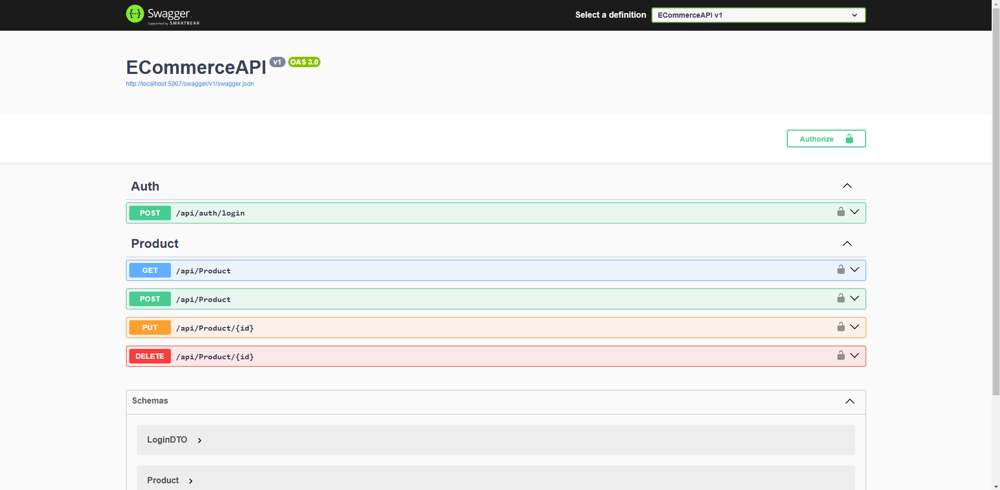

# E-Commerce API 🛒  



This is a **scalable and secure** e-commerce API built with **C# and ASP.NET Core**. It includes essential features like **JWT authentication and product management**.  

## 🚀 Features  

✅ **JWT Authentication** – Secure access with token-based authentication  
✅ **Product Management** – Add, update, delete, and retrieve products  
✅ **Database Integration** – Uses PostgreSQL for data persistence  
✅ **Error Handling & Validation** – Ensures data integrity and security  
✅ **Swagger Documentation** – Fully documented API with Swagger UI  

## 🛠 Tech Stack  

- **Backend:** ASP.NET Core, Entity Framework Core  
- **Database:** PostgreSQL  
- **Authentication:** JWT (JSON Web Token)  
- **API Documentation:** Swagger  

## 📦 Installation & Setup  

1. Clone the repository:  
   ```bash
   git clone https://github.com/mustafa-bagci/ECommerceAPI.git
   cd ECommerceAPI
   ```  

2. Set up the database (PostgreSQL required):  
   ```bash
   dotnet ef database update
   ```  

3. Configure environment variables (`appsettings.json`):  
   ```json
   {
     "Jwt": {
       "Key": "your-secret-key",
       "Issuer": "ECommerceAPI",
       "Audience": "ECommerceAPIUsers"
     },
     "ConnectionStrings": {
       "DefaultConnection": "Host=localhost;Database=ECommerceDB;Username=postgres;Password=yourpassword"
     }
   }
   ```  

4. Run the API:  
   ```bash
   dotnet run
   ```  

## 🔑 Authentication & JWT  

To authenticate, send a `POST` request to `/api/auth/login` with:  
```json
{
  "username": "admin",
  "password": "password"
}
```  
The response will return a JWT token that must be included in subsequent requests as a `Bearer` token in the headers.  

## 📖 API Endpoints  

| Method | Endpoint            | Description             | Auth Required |
|--------|---------------------|-------------------------|--------------|
| GET    | /api/products       | Get all products       | ❌ No        |
| POST   | /api/products       | Add a new product      | ✅ Yes       |
| PUT    | /api/products/{id}  | Update a product       | ✅ Yes       |
| DELETE | /api/products/{id}  | Delete a product       | ✅ Yes       |
| POST   | /api/auth/login     | Get JWT Token          | ❌ No        |

## 📚 API Documentation  

You can explore the API using **Swagger UI**:  
- Run the project  
- Open [http://localhost:5007/swagger](http://localhost:5007/swagger) in your browser  

## 🤝 Contributing  

Feel free to contribute by opening an issue or submitting a pull request.  

## 📝 License  

This project is licensed under the **MIT License**.
